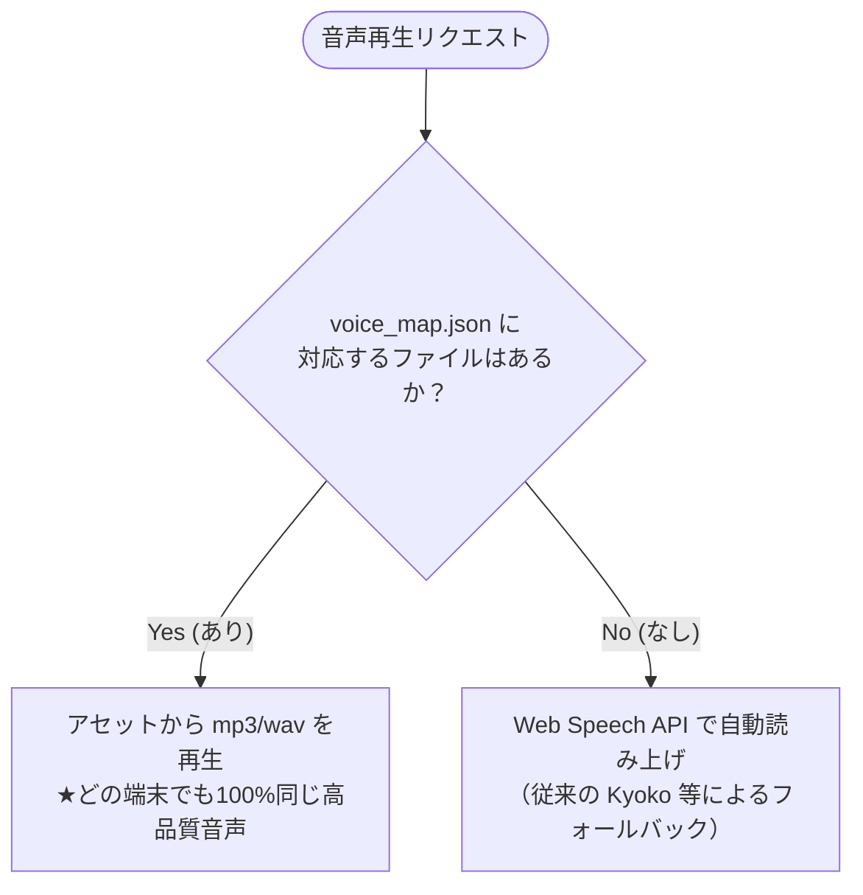

# 🎙️ 音声アセット配置・運用ガイド

本フォルダー (`assets/voices/`) は、ゲーム内で再生される高品質なAIキャラクター音声（`.mp3` または `.wav`）を格納するための場所です。

これまでのブラウザ音声合成（Web Speech API）による端末ごとの音質差や再生エラーを解決するため、事前に生成した音声アセットを再生する設計へ移行します。

---

## 📂 構成ファイル一覧

1. **`assets/voices/` (本フォルダー)**: 生成した音声ファイル（`.mp3` または `.wav`）をすべてここに格納します。
2. **`assets/voices/voice_map.json`**: ゲーム内の各読み上げテキストと、対応する音声ファイルのパスを紐付けるための定義ファイルです。

---

## 🛠️ 音声アセットの作成と命名規則

VOICEVOXやクラウド音声合成サービス等を使用し、以下のテキスト内容を読み上げさせた音声ファイルを作成してください。

### 1. ストーリー関連（固定音声）
| ID / キー | テキスト内容 | 推奨ファイル名 |
| :--- | :--- | :--- |
| `story_1` | 「たいへんです！おひめさまが わるいモンスターの のろいで カエルに かえられてしまいました！」 | `story_1.mp3` |
| `story_2` | 「ひろいダンジョンに かくされた「ちしきのクリスタル」を 5つ さがしだし、クイズに せいかいして のろいを といてください！」 | `story_2.mp3` |

### 2. システムフィードバック（固定音声）
| ID / キー | テキスト内容 | 推奨ファイル名 |
| :--- | :--- | :--- |
| `correct` | 「せいかい！」 | `correct.mp3` |
| `incorrect` | 「ざんねん、ちがいます」 | `incorrect.mp3` |
| `timeout` | 「じかんぎれです！」 | `timeout.mp3` |

### 3. クイズ問題（動的音声）
クイズ問題は数字の組み合わせによって生成されるため、以下のように命名して登録します。
* **足し算形式 (AたすBは？)**: `quiz_{A}_plus_{B}.mp3` (例: `quiz_5_plus_3.mp3`)
* **引き算形式 (AひくBは？)**: `quiz_{A}_minus_{B}.mp3` (例: `quiz_10_minus_4.mp3`)

---

## 🔄 音声読み上げのプログラム制御（ハイブリッド設計）

ゲームの実行時、以下の順序で音声をインテリジェントに選択・再生します：

この設計により、**「主要なストーリーや正解ボイスは高品質な音声ファイルで再生しつつ、未作成のクイズ音声は自動で従来の読み上げにフォールバックする」** という、ゲームとして極めて安全かつシームレスな移行が可能になります。
